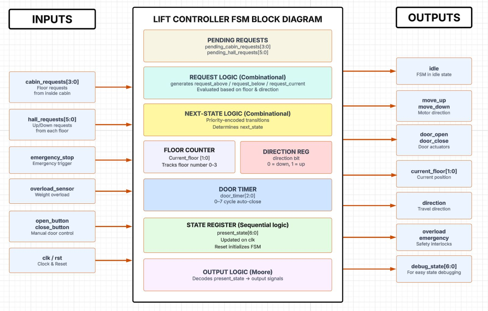
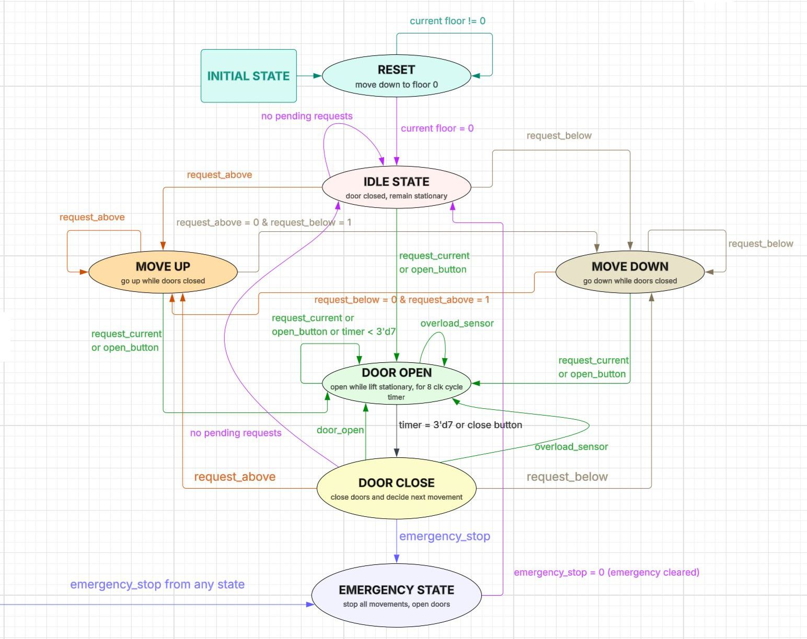

# Advanced Lift Controller using FSM in Verilog HDL
## 1. Objective
The objective of this project is to design and implement an **Advanced Lift Controller using a Finite State Machine (FSM) in Verilog HDL**. The controller manages reset homing, lift movement, floor requests (both cabin and hall requests), door operations, direction control, overload protection, and emergency handling while ensuring safe and efficient operation.

## 2. Features
- Reset homing
- Four-floor lift system (Floors 0–3)
- Cabin request handling
- Hall request handling (Up/Down)
- Direction-based scheduling
- Automatic door opening and closing
- Emergency stop functionality
- Overload protection
- FSM-based control architecture
- Debug state monitoring
## 3. System Inputs

| Signal | Description |
|----------|------------|
| `clk` | System clock |
| `rst` | System reset |
| `cabin_requests[3:0]` | Floor requests from inside the lift cabin |
| `hall_requests[5:0]` | Up/Down hall requests from each floor |
| `emergency_stop` | Emergency trigger input |
| `overload_sensor` | Detects overload condition |
| `open_button` | Manual door open command |
| `close_button` | Manual door close command |

---

## 4. System Outputs

| Signal | Description |
|----------|------------|
| `idle` | Indicates idle state |
| `move_up` | Commands lift to move upward |
| `move_down` | Commands lift to move downward |
| `door_open` | Opens the lift door |
| `door_close` | Closes the lift door |
| `current_floor[1:0]` | Current floor position |
| `debug_state[6:0]` | FSM state monitoring output |
| `direction` | Current travel direction |
| `overload` | Overload status indication |
| `emergency` | Emergency status indication |

---

## 5. FSM States

| State | Description | State Encoding |
|---------|------------|---------------|
| idle_state | Waiting for requests | 7'b0000001 |
| move_up_state | Lift moving upward | 7'b0000010 |
| move_down_state | Lift moving downward | 7'b0000100 |
| door_open_state | Door is open for passenger entry/exit | 7'b0001000 |
| door_close_state | Door is closing before movement | 7'b0010000 |
| emergency_state | Emergency stop activated | 7'b0100000 |
| rst_state | Reset/Homing state, returns lift to ground floor | 7'b1000000 |

---

## 6. Block Diagram

**Figure 1: Functional block diagram of the FSM-based Lift Controller.**

## 7. Functional Description
- **Pending Request Management:** Cabin and hall requests are stored in dedicated pending request registers. Requests remain active until the corresponding floor is serviced.
- **Request Logic:** The request logic determines whether pending requests exist above, below, or at the current floor. These signals are used by the FSM to make scheduling decisions.
- **Next State Logic:** The next-state logic is the decision-making component of the controller. It evaluates requests, current floor, direction, overload, and emergency conditions to determine the next FSM state.
- **State Register:** The state register stores the current FSM state and updates on each clock edge. Reset gets the controller to the ground floor, eventually reaching the IDLE state.
- **Floor Counter:** The floor counter tracks the current floor position of the lift and updates during movement states.
- **Door Timer:** The door timer keeps the door open for a fixed number of clock cycles before initiating automatic closure.
- **Output Logic:** The Moore output logic generates control signals solely based on the current FSM state.

## 8. State Transition Table

| Present State | Condition / Input | Next State | Description |
|---------------|------------------|------------|-------------|
| RESET | `current_floor != 0` | RESET | Continue moving toward ground floor |
| RESET | `current_floor == 0` | IDLE | Reset complete, enter idle state |
| IDLE | `request_above = 1` | MOVE_UP | Service requests above current floor |
| IDLE | `request_below = 1` | MOVE_DOWN | Service requests below current floor |
| IDLE | `request_current = 1` or `open_button = 1` | DOOR_OPEN | Open door at current floor |
| IDLE | No pending requests | IDLE | Remain stationary |
| IDLE | `emergency_stop = 1` | EMERGENCY | Enter emergency state |
| MOVE_UP | `request_current = 1` or `open_button = 1` | DOOR_OPEN | Stop and open door at requested floor |
| MOVE_UP | `request_above = 1` | MOVE_UP | Continue upward movement |
| MOVE_UP | `request_above = 0` and `request_below = 1` | MOVE_DOWN | Reverse direction to serve lower requests |
| MOVE_UP | No pending requests | IDLE | Return to idle state |
| MOVE_UP | `emergency_stop = 1` | EMERGENCY | Emergency stop activated |
| MOVE_DOWN | `request_current = 1` or `open_button = 1` | DOOR_OPEN | Stop and open door at requested floor |
| MOVE_DOWN | `request_below = 1` | MOVE_DOWN | Continue downward movement |
| MOVE_DOWN | `request_below = 0` and `request_above = 1` | MOVE_UP | Reverse direction to serve upper requests |
| MOVE_DOWN | No pending requests | IDLE | Return to idle state |
| MOVE_DOWN | `emergency_stop = 1` | EMERGENCY | Emergency stop activated |
| DOOR_OPEN | `overload_sensor = 1` | DOOR_OPEN | Keep door open until overload clears |
| DOOR_OPEN | `door_timer < 7` | DOOR_OPEN | Maintain door-open interval |
| DOOR_OPEN | `door_timer == 7` or `close_button = 1` | DOOR_CLOSE | Begin closing door |
| DOOR_OPEN | `emergency_stop = 1` | EMERGENCY | Emergency stop activated |
| DOOR_CLOSE | `door_open = 1` | DOOR_OPEN | Re-open door if required |
| DOOR_CLOSE | `request_above = 1` | MOVE_UP | Continue servicing upward requests |
| DOOR_CLOSE | `request_below = 1` | MOVE_DOWN | Continue servicing downward requests |
| DOOR_CLOSE | No pending requests | IDLE | Return to idle state |
| DOOR_CLOSE | `emergency_stop = 1` | EMERGENCY | Emergency stop activated |
| EMERGENCY | `emergency_stop = 1` | EMERGENCY | Remain in emergency state |
| EMERGENCY | `emergency_stop = 0` | IDLE | Resume normal operation |

- **Assumption:** The overload_sensor detects overload while the lift is open and people are getting into the lift. Hence, no such condition of overload arises when the lift is moving or the doors are closed. So, we consider overload_sensor input in the door_open state only.

## 9. State Transition Summary

**Figure 2: FSM State Transition Diagram.**

## 10. Simulation Results

Detailed waveform analysis and corner-case verification report for important cases:
[Working_of_imp_testcases_Lift_controller.pdf](important_corner_testcases/Working_of_imp_testcases_Lift_controller.pdf)

## 11. Conclusion
The Advanced Lift Controller was successfully designed and implemented using Verilog HDL and an FSM-based architecture. The controller correctly handled cabin requests, hall requests, directional scheduling, door operations, overload protection, and emergency conditions. Simulation results verified the correct operation of all major functionalities and demonstrated reliable lift behavior under various operating scenarios.
